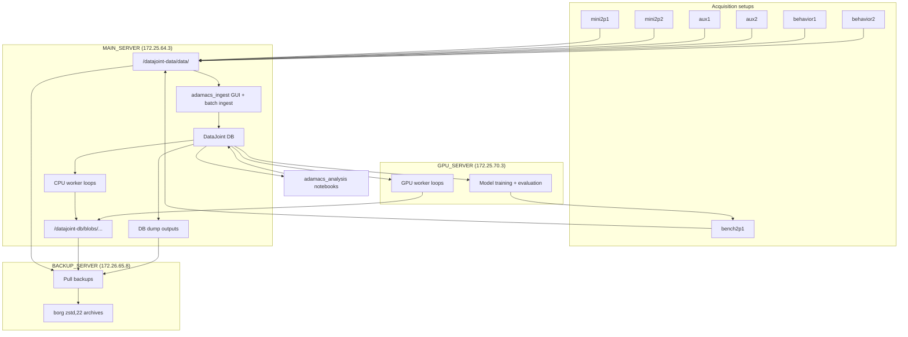

# adamacs_documentation

> **Primary ADAMACS Documentation Repository:**  
> <https://github.com/trose-neuro/adamacs_documentation>
>
> Link to this repository from all ADAMACS codebases as the canonical documentation source.

Central Read the Docs source for ADAMACS ingest + analysis operations.

This repository is designed as a deep, student-facing and operator-facing documentation hub covering:
- day-to-day ingest using `adamacs_ingest`
- day-to-day analysis using `adamacs_analysis`
- lab server roles, workers, permissions, and backup flows
- troubleshooting and contributor workflows

## Documentation scope

The docs are organized into five top-level sections (modeled after multi-pipeline RTD navigation patterns):
- `Common`: onboarding, environment setup, config, access, troubleshooting
- `Ingest`: GUI workflow, batch ingest, modality-specific ingest routes, notebook map
- `Analysis`: analysis workflow, querying patterns, schema scaffolding, notebook map
- `Infrastructure`: server architecture, worker-owned populations, backups, permissions
- `Developer Documentation`: split-repo model, contribution workflow, docs maintenance

## High-level architecture



## Build docs locally

From repository root:

```bash
python -m venv .venv
source .venv/bin/activate
python -m pip install --upgrade pip
python -m pip install -r requirements-docs.txt
sphinx-build -b html docs docs/_build/html
```

Open:
- `docs/_build/html/index.html`

## View docs immediately

After local build, open:
- `docs/_build/html/index.html`

or run a simple local server:

```bash
python -m http.server --directory docs/_build/html 9000
```

then browse:
- `http://localhost:9000`

## Read the Docs configuration

This repository is RTD-ready via:
- `.readthedocs.yaml`
- `docs/conf.py`

## External component documentation

For upstream toolchain references (DataJoint, Elements, Suite2p, DeepLabCut, DISK, CASCADE), use:
- `docs/common/external_references.md`

## Canonical upstream repositories

Operational code lives in:
- `adamacs_ingest`: ingest-first pipeline repo
- `adamacs_analysis`: analysis-first student fork/workspace repo
- `adamacs` (legacy monorepo): historical source and compatibility context

## Maintenance note

This documentation was updated with the current known operational state as of **2026-02-10**.
If server topology or worker scripts change, update:
- `docs/infrastructure/architecture.md`
- `docs/infrastructure/worker_population.md`
- `docs/infrastructure/backups.md`

## Private deployment target

Target hosting model:
- private repository under GitHub org `your-org`
- optional private Read the Docs deployment

Deployment runbook:
- `docs/developer/deploy_private_repository.md`
