# Database Structure (Verbose)

This chapter documents the ADAMACS database structure with real `dj.Diagram` outputs.

For table-by-table, user-facing chapters, see:
- `Analysis -> Schema Chapters (User-Focused)`

## Why this chapter exists

In the ADAMACS pipeline philosophy, schema diagrams are operational documents.
They tell you:
- what is allowed to depend on what
- where provenance boundaries are
- which keys must stay stable across reprocessing

If a join is surprising, the diagram is usually where the mistake becomes obvious.

## Source of figures

Diagrams were exported from:
- `adamacs_analysis/notebooks/21_schema_dependency_diagrams.ipynb`

The copies in this docs repo are stored under:
- `docs/assets/db_diagrams/`

## How to read these diagrams

- Underlined table names are manual/lookup roots.
- Elliptical nodes are computed/imported tables.
- Part tables appear as subordinate nodes.
- Shared keys (`session_id`, `scan_id`) are the main join backbone.

## Reading strategy (recommended)

Read the chapter in this order:
1. `subject` -> `session` -> `scan` (identity and acquisition backbone)
2. `event` + `trial` + `behavior` (time ontology and behavioral structure)
3. `imaging` + `model` (main feature-generation branches)
4. `mocap` + `pupil_tracking` + `virtual_markers_optitrack` (extended kinematic/pose branches)

## Global key flow

```{mermaid}
flowchart LR
    A["subject.Subject"] --> B["session.Session"]
    B --> C["scan.Scan"]
    C --> D["event.BehaviorRecording"]
    D --> E["event.Event"]
    D --> F["trial.Trial"]
    E --> G["trial.TrialEvent"]
    F --> G
    C --> H["imaging.ProcessingTask / imaging.Processing"]
    C --> I["model.PoseEstimationTaskNew / model.PoseEstimationNew"]
    C --> J["mocap.MotionCaptureTask / mocap.MotionCapture"]
```

## Core schemas

### Subject

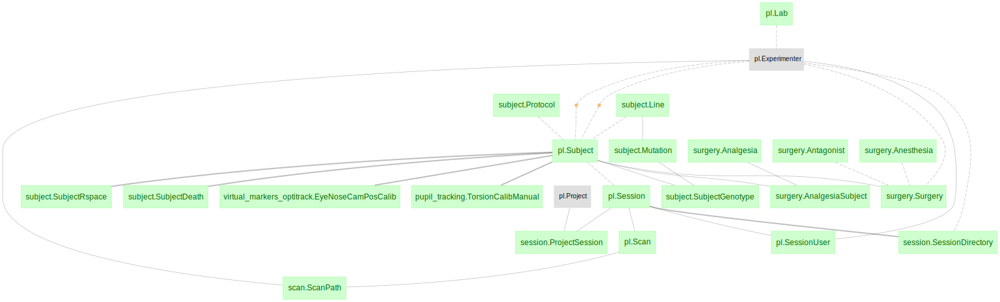

### Session

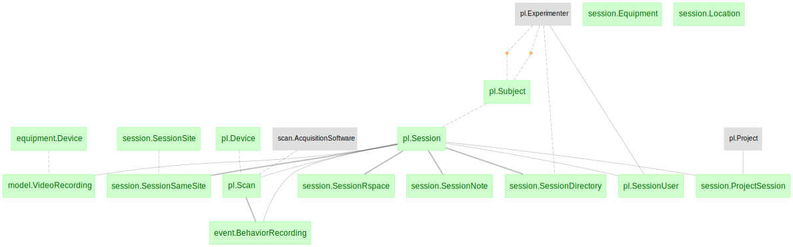

### Scan

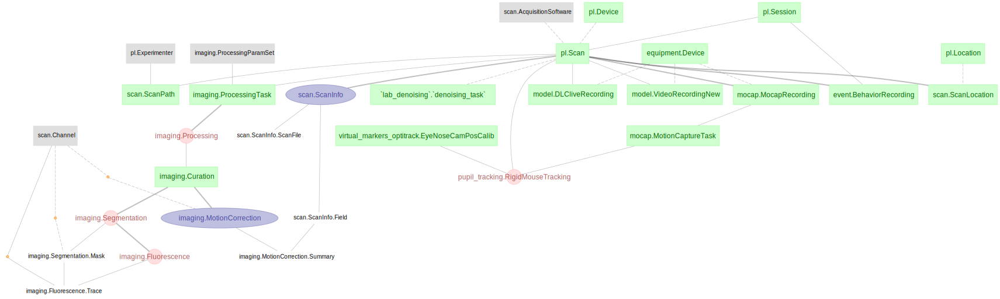

### Event


### Trial

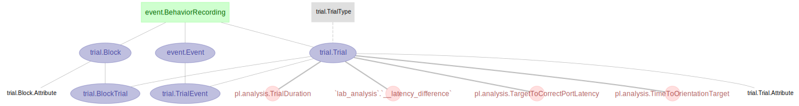

### Behavior

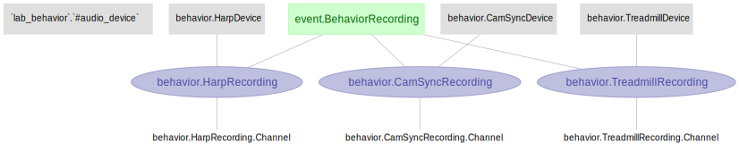

### Imaging

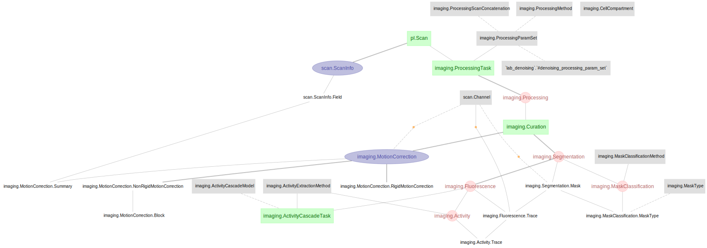

### Model (DLC / pose)

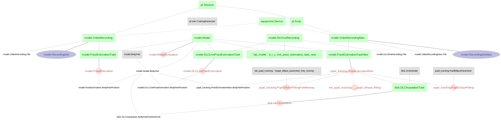

## Extended/linked schemas

### Mocap

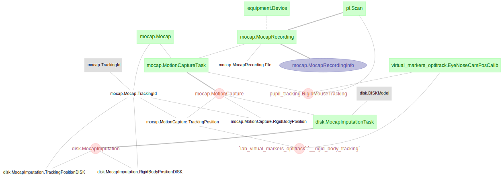

### Pupil tracking

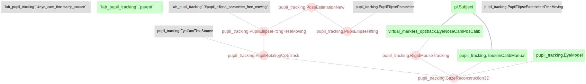

### Virtual markers (OptiTrack)

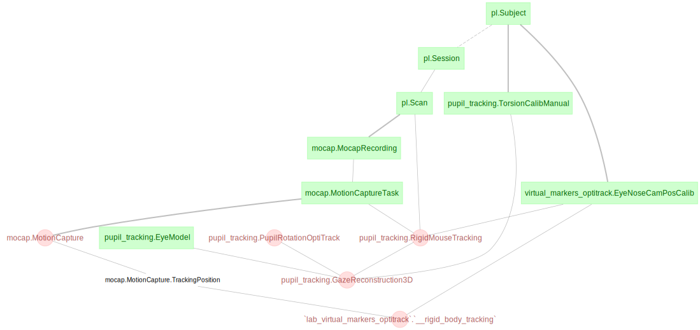

### Disk

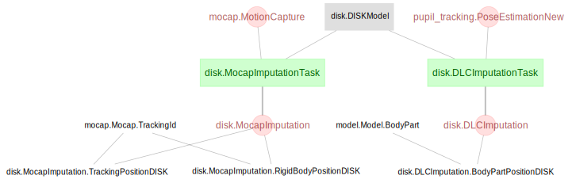

### Equipment

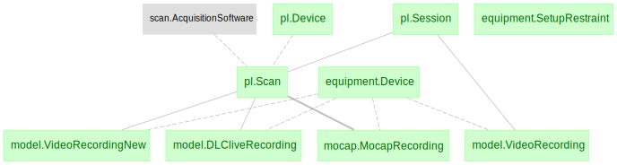

### Surgery

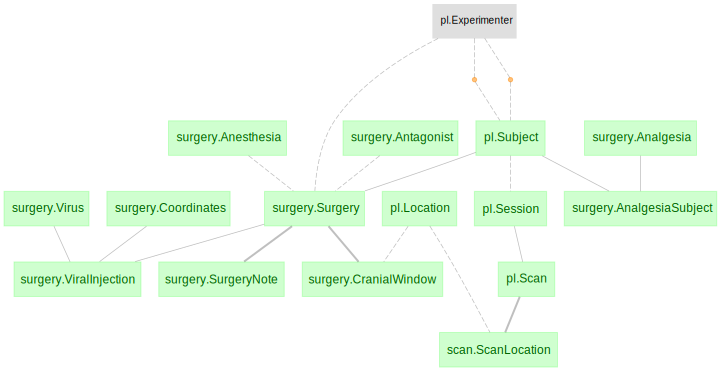

## Practical query anchor points

Start most joins from these anchors:
- `session_id`
- `scan_id`
- `paramset_idx` (imaging)
- `curation_id` (imaging curation path)
- `model_name` (pose/DLC)

For event/trial-specific structure, see:
- `Ingest -> Event/Trial Ontology`

## Guardrails for analysis code

- Keep key restrictions explicit in each notebook section.
- Treat label vocabularies (`event.EventType`, `trial.TrialType`) as shared contracts.
- Avoid “magic” derived DataFrames that hide key lineage.
- When in doubt, re-open the diagram and verify dependency direction before adding joins.
