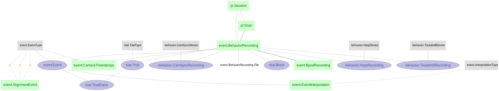

# Event Schema

Schema: `event`

This schema is the time ontology backbone for event-aligned analysis.
It defines event vocabulary, recording-level timelines, and event windows used by downstream trial and alignment logic.

## What this schema answers

- Which event labels exist and what do they mean?
- Which event instances were detected for a recording/scan?
- Which alignment windows should be used for peri-event analysis?

## Core tables used most often

- `event.EventType`
- `event.BehaviorRecording`, `event.BehaviorRecording.File`
- `event.Event`
- `event.AlignmentEvent`
- `event.InterpolationType`, `event.EventInterpolation` (when interpolation is used)

## Query anchors

- `session_id`
- `scan_id`
- `event_type`
- `event_start_time`

```python
scan_key = {'session_id': 'sessXXXXXXXX', 'scan_id': 'scanXXXXXXXX'}
(event.Event & scan_key)
(event.Event & scan_key & "event_type='aux_cam'")
```

## Diagram



## Notes for users

- Keep event labels in `event.EventType`; avoid notebook-only label variants.
- Confirm clock conventions before cross-modal latency analysis.
- Use event windows from schema tables, not hard-coded notebook constants.

## Element lineage

ADAMACS event/trial structure follows Element Event concepts.
Reference: <https://docs.datajoint.com/elements/element-event/0.2/concepts/>
