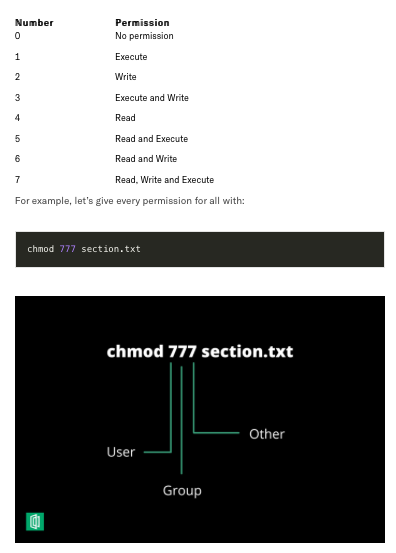
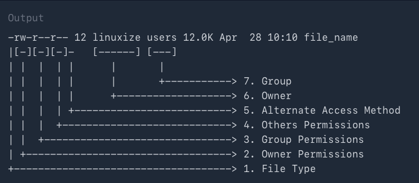
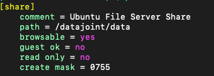

# Permissions and Ownership

This page explains the difference between DataJoint SQL permissions and Linux filesystem permissions.

## Two permission layers

1. Database permissions (MySQL/DataJoint)
   - controls table read/write/create/update operations
2. Filesystem permissions (Linux paths)
   - controls write access to on-disk data and blob storage

A user can pass SQL checks and still fail on filesystem writes.

## Typical conflict case

Error during manual populate:

```text
Permission denied: /datajoint-db/blobs/.../*.saving
```

Interpretation:
- your DB user may be allowed to insert table rows
- your Linux account cannot write temporary/final blob files in that path

## Why worker accounts succeed

Worker processes run under service accounts configured with required filesystem group/ownership access for blob and output directories.

## Permission model visuals (sanitized)

These reference visuals are included because they help quickly explain recurring support tickets around Unix modes and share behavior.

### Unix permission bits reminder





### Share configuration reminder



Operational note:
- share-level access and filesystem-level ownership/mode bits both matter.
- changing one without the other can still leave users blocked.

## Practical policy for students

- Use ingest GUI for metadata + task staging.
- Let workers handle blob-heavy and long-running compute tables.
- Run manual populate only for approved lightweight tables.

## Inspecting directory ownership (admin/operator)

```bash
ls -ld /datajoint-db/blobs/
ls -l /datajoint-db/blobs/<prefix>
```

Look for:
- owner user
- group (for example datajoint admin group)
- write bits for owner/group

## Database grant example (admin-only)

```sql
GRANT SELECT, INSERT, CREATE, UPDATE ON `lab_%`.* TO 'username'@'%';
```

This does **not** configure Linux filesystem write access.

## Secure operations notes

- avoid broad write grants for all users to shared blob roots
- prefer worker-mediated writes for sensitive outputs
- keep webhook secrets and credentials out of repository code
- avoid posting account credentials or personal identifiers in shared docs

## Permission debugging checklist

1. Confirm table-level SQL grants for the DB user.
2. Confirm filesystem write access for the Linux user/group.
3. Reproduce on one key only.
4. Verify whether the same key succeeds via worker account.
5. Decide whether to adjust policy (preferred) or permissions (carefully).
