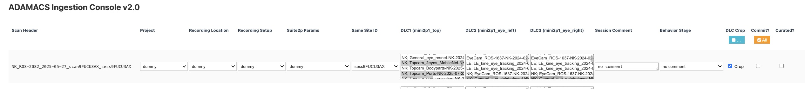
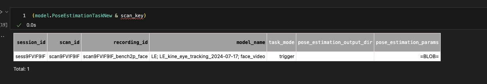
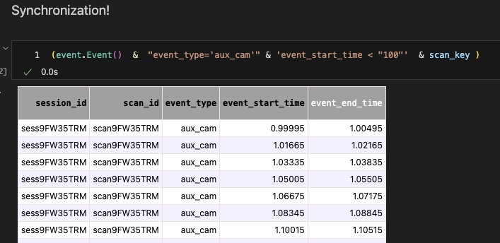
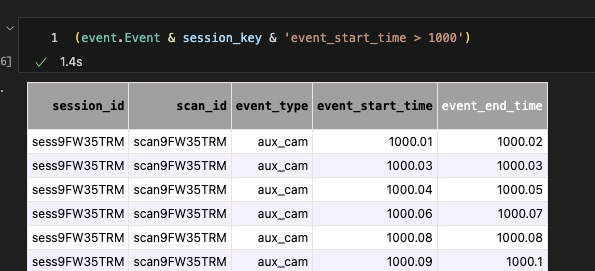

# Ingest GUI Quickstart (`ingestgui_v2`)

Use this when you want to ingest sessions quickly and safely.

## 1. Open the correct notebook

Open:
- `adamacs_ingest/notebooks/00_ingest_gui_workflow_adamacs_ingest_v2.ipynb`

Use these defaults:

```python
selected_data, get_dlc_models = ai.select_sessions(
    sorted_dirs_root,
    do_population=False,
    rspace_upload=False,
    ingest_opt="trigger",
)
```

## 2. Filter sessions, then launch GUI

```python
ADAMACS_SESSION_FILTER = "*XX*"
ADAMACS_DATE_FILTER = ">2025-06-01*"
ADAMACS_LAUNCH_GUI = True
```

Folder names must contain parseable session/scan tokens, for example:
- `..._YYYY-MM-DD_sess..._scan...`

## 3. Fill GUI rows and commit



Required fields to verify before commit:
- `Project`
- `Recording Location`
- `Recording Setup`
- `Suite2p Params`
- `DLC1/2/3` (leave defaults unless you need a different model)
- `Commit?` is checked

Usually optional:
- `Same Site ID`
- `Session Comment`
- `Behavior Stage`
- `Curated?`

Recommended default:
- Keep `DLC Crop` enabled unless you have a specific reason to disable it.

## 4. 30-second success check

After commit, run:

```python
(imaging.ProcessingTask() & scan_key)
(model.PoseEstimationTaskNew & scan_key)
```



For sync sanity checks:

```python
(event.Event() & "event_type='aux_cam'" & 'event_start_time < "100"' & scan_key)
(event.Event() & "event_type='aux_cam'" & 'event_start_time > "1000"' & scan_key)
```




## 5. If it fails

- No sessions shown:
  check `ADAMACS_SESSION_FILTER`, `ADAMACS_DATE_FILTER`, and `custom.exp_root_data_dir`.
- No tasks after commit:
  confirm `Commit?` is checked and `Suite2p Params` is not dummy.
- Sync checks empty:
  verify aux camera/event files exist for that scan.

## User defaults

Defaults are read from `user_configs/<initials>.ini`.


## Related pages

- `Ingest -> Event/Trial Ontology`
- `Ingest -> Modalities`
